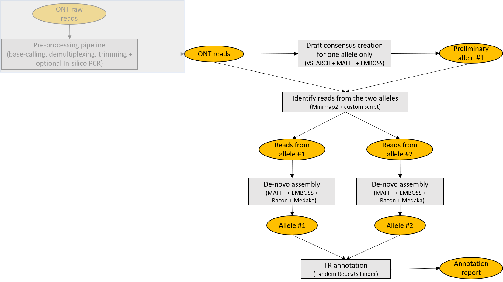
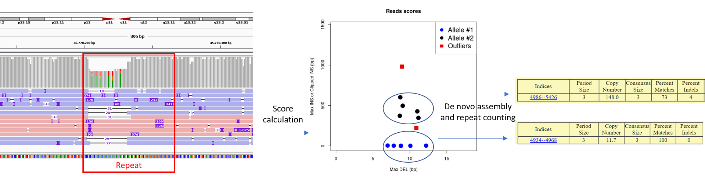
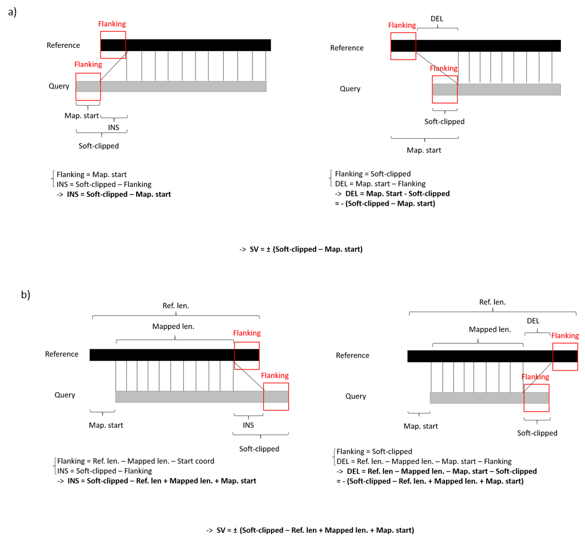

# CharONT

**CharONT** is a consensus calling pipeline meant for characterizing long genomic regions from diploid organisms. Starting from ONT reads including a shared flanking sequence, it provides consensus sequences for the two alleles and tandem repeats annotations. In case you used an enrichment method different to PCR (e.g. CRISPR-Cas9 or Xdrop), or performed WGS, amplicon-like sequences can be extracted _in-silico_ based on known flanking sequences. Moreover, a preprocessing pipeline is provided, so to make the whole bioinformatic analysis from raw fast5 files to consensus sequences straightforward and simple.

<p align="center">
  
</p>

## Getting started

**Prerequisites**

* Miniconda3.
Tested with conda 4.9.2.
```which conda``` should return the path to the executable.
If you don't have Miniconda3 installed, you could download and install it with:
```
wget https://repo.anaconda.com/miniconda/Miniconda3-latest-Linux-x86_64.sh
chmod 755 Miniconda3-latest-Linux-x86_64.sh
./Miniconda3-latest-Linux-x86_64.sh
```

Then, after completing _CharONT_ installation, set the _MINICONDA_DIR_ variable in **config_CharONT.R** to the full path to miniconda3 directory.

* Guppy, the software for basecalling and demultiplexing provided by ONT. Tested with Guppy v4.5.
If you don't have [Guppy](https://community.nanoporetech.com/downloads) installed, choose an appropriate version and install it.
For example, you could download and unpack the archive with:
```
wget /path/to/ont-guppy-cpu_version_of_interest.tar.gz
tar -xf ont-guppy-cpu_version_of_interest.tar.gz
```
A directory _ont-guppy-cpu_ should have been created in your current directory.
Then, after completing _CharONT_ installation, set the _BASECALLER_DIR_ variable in **config_CharONT.R** to the full path to _ont-guppy-cpu/bin_ directory.

**Installation**

```
git clone https://github.com/MaestSi/CharONT.git
cd CharONT
chmod 755 *
./install.sh
```

A conda environment named _CharONT\_env_ is created, where emboss, vsearch, seqtk, mafft, minimap2, samtools, racon, medaka, NanoFilt, Tandem Repeat Finder, BBMap and R with package Biostrings are installed. Another conda environment named _pycoQC\_env_ is created, where pycoQC is installed. 
Then, you can open the **config_CharONT.R** file with a text editor and set the variables _PIPELINE_DIR_ and _MINICONDA_DIR_ to the value suggested by the installation step.

## Overview

<p align="center">
  
</p>

**Identification of reads from the two alleles**

After creating a preliminary consensus sequence for Allele #1, all reads are mapped to it and, based on the CIGAR string, the biggest DEL and INS are identified for each read, resulting in a bidimensional Score. At this point, reads with either component of the Score deviating from the 1st or 3rd inter quartile range (IQR) for more than  _IQR\_outliers\_coef\_precl_\*IQR are labelled as candidate outliers, and are excluded from the k-means clustering. After clustering, IQR is computed within each cluster for both components of the Score, and reads with either component deviating from the 1st or 3rd IQR for more than _IQR\_outliers\_coef_\*IQR are labelled as outliers. Scores are plotted so that the user may tune _IQR\_outliers\_coef\_precl_ and _IQR\_outliers\_coef_ parameters according to their preferences, based on visual inspection of \<sample_name\>\_reads\_scores.png. In the provided example, reads from Allele #2 show 400 bp INS with respect to Allele #1. Notably, one read with 1000 bp INS is identified, which may indicate a somatic variant.

<p align="center">
  
</p>

Also in case the SV is too big to allow mapping of reads at both 5' and 3' flanking regions, the size of the SV is estimated from soft-clipping. In particular, depending on whether soft-clipping occurs at the 5' end **a)** or at the 3' end **b)**, a different formula is applied for calculating the size of the SV compared to Allele #1, used as a Reference.

<p align="center">
  
</p>

## Usage

The CharONT pipeline can be applied either starting from raw fast5 files, or from already basecalled and demultiplexed sequences. 
In both cases, the first step of the pipeline requires you to open the **config_CharONT.R** file with a text editor and to modify it according to the features of your sequencing experiment and your preferences.
If you have already basecalled and demultiplexed your sequences, you can run the pipeline using the **CharONT.R** script.
Otherwise, you can run the pipeline using the **Launch_CharONT.sh** script. If you have basecalled sequences that need filtering and trimming to look like PCR amplicons, the script **Extract_amplicons.sh** can be applied prior to **CharONT.R**.

**CharONT.R**

Usage: Rscript CharONT.R \<analysis_dir\>

Note: Activate the virtual environment with ```source activate CharONT_env``` before running. The script is run by **CharONT_preprocessing.R**, but can be also run as a main script if you have already basecalled and demultiplexed your sequences.

Inputs:
* \<analysis_dir\>: directory containing fastq files for each sample

Outputs (saved in <analysis_dir>):
* \<"sample_name"\_first_allele.fasta\>: consensus sequence for first allele in fasta format
* \<"sample_name"\_first_allele.fasta."trf scores".html\>: Tandem Repeat Finder report for first allele sequence
* \<"sample_name"\_second_allele.fasta\>: consensus sequence for second allele in fasta format
* \<"sample_name"\_second_allele.fasta."trf scores".html\>: Tandem Repeat Finder report for second allele sequence
* \<"sample_name"\>: directory including intermediate files

**Launch_CharONT.sh**

Usage:
Launch_CharONT.sh \<fast5_dir\>

Note: modify **config_CharONT.R** before running; the script runs the full pipeline from raw fast5 files to consensus sequences.

Input
* \<fast5_dir\>: directory containing raw fast5 files

Outputs (saved in \<fast5_dir\>\_analysis/analysis):

* \<"sample_name"\_first_allele.fasta\>: consensus sequence for first allele in fasta format
* \<"sample_name"\_first_allele.fasta."trf scores".html\>: Tandem Repeat Finder report for first allele sequence
* \<"sample_name"\_second_allele.fasta\>: consensus sequence for second allele in fasta format
* \<"sample_name"\_second_allele.fasta."trf scores".html\>: Tandem Repeat Finder report for second allele sequence
* \<"sample_name"\>: directory including intermediate files

Outputs (saved in \<fast5_dir\>\_analysis/qc):
* Read length distributions and pycoQC report

Outputs (saved in \<fast5_dir\>\_analysis/basecalling):
* Temporary files for basecalling

Outputs (saved in \<fast5_dir\>\_analysis/preprocessing):
* Temporary files for demultiplexing, filtering based on read length and adapters trimming

**Extract_amplicons.sh**

Usage: Extract_amplicons.sh \<"sample_name".fastq\> \<primer_sequence_one\> \<primer_sequence_two\> \<pcr_id_thr\>

Note: Activate the virtual environment with ```source activate CharONT_env``` before running.

Inputs:
* \<"sample_name".fastq\>: fastq file containing reads that need filtering and trimming to look like amplicons
* \<primer_sequence_one\>: sequence of first _in-silico_ PCR primer to look for, flanking the region of interest
* \<primer_sequence_two\>: sequence of second _in-silico_ PCR primer to look for, flanking the region of interest
* \<pcr_id_thr>: minimum identity threshold that _in-silico_ PCR primers need for annealing

Outputs:
* \<"sample_name"\_trimmed.fastq\>: fastq file containing amplicon-like sequences extracted from \<"sample_name".fastq\> based on \<primer_sequence_one\> and \<primer_sequence_two\> sequences
* \<"sample_name"\_in_silico_pcr_one.sam\>: sam file containing alignments between \<primer_sequence_one\> and \<fastq_reads\>
* \<"sample_name"\_in_silico_pcr_two.sam\>: sam file containing alignments between \<primer_sequence_two\> and \<fastq_reads\>

**Extract_Xdrop_alignments.sh**

Usage: Extract_Xdrop_alignments.sh \<"sample_name".fastq\> \<reference_genome.fasta\> \<target_file.bed\>

Note: Activate the virtual environment with ```source activate CharONT_env``` before running; moreover, pcrclipreads.jar and samextractclip.jar from jvarkit should be installed.

Inputs:
* \<"sample_name".fastq\>: fastq file containing reads that need filtering and trimming and chimera removal to look like amplicons
* \<reference_genome.fasta\>: fasta file with reference genome (e.g. hg38 human genome)
* \<target_file.bed\>: bed file with the coordinates of the target of interest and the flanking regions

Outputs:
* \<"sample_name"\_target_extracted.fastq\>: fastq file containing amplicon-like sequences in forward orientation extracted from \<"sample_name".fastq\> based on the bed file coordinates
* \<Xdrop_reads_extraction\>: directory containing temporary files


## Auxiliary scripts

In the following, auxiliary scripts run either by **CharONT.R** or by **Launch_CharONT.sh** are listed. These scripts should not be called directly.

**CharONT_preprocessing.R**

Note: script run by _Launch_CharONT.sh_.

**config_CharONT.R**

Note: configuration script, must be modified before running _Launch_CharONT.sh_ or _CharONT.R_.

**subsample_fast5.sh**

Note: script run by _CharONT_preprocessing.R_ if _do_subsampling_flag_ variable is set to 1 in _config_CharONT.R_.

## Citation

For further information, please refer to the following manuscripts:

De Coster W, D'Hert S, Schultz DT, Cruts M, Van Broeckhoven C. NanoPack: visualizing and processing long-read sequencing data. Bioinformatics. 2018;34(15):2666-2669. doi:10.1093/bioinformatics/bty149

Li H. Minimap2: pairwise alignment for nucleotide sequences. Bioinformatics. 2018 Sep 15;34(18):3094-3100. doi: 10.1093/bioinformatics/bty191. PMID: 29750242; PMCID: PMC6137996.

R Core Team (2017). R: A language and environment for statistical computing. R Foundation for Statistical Computing, Vienna, Austria. URL https://www.R-project.org/.

Li H, Handsaker B, Wysoker A, Fennell T, Ruan J, Homer N, Marth G, Abecasis G, Durbin R; 1000 Genome Project Data Processing Subgroup. The Sequence Alignment/Map format and SAMtools. Bioinformatics. 2009 Aug 15;25(16):2078-9. doi: 10.1093/bioinformatics/btp352. Epub 2009 Jun 8. PMID: 19505943; PMCID: PMC2723002.

Leger et al., (2019). pycoQC, interactive quality control for Oxford Nanopore Sequencing. Journal of Open Source Software, 4(34), 1236, https://doi.org/10.21105/joss.01236

Benson G. Tandem repeats finder: a program to analyze DNA sequences. Nucleic Acids Res. 1999 Jan 15;27(2):573-80. doi: 10.1093/nar/27.2.573. PMID: 9862982; PMCID: PMC148217.

Rognes T, Flouri T, Nichols B, Quince C, Mahé F. VSEARCH: a versatile open source tool for metagenomics. PeerJ. 2016 Oct 18;4:e2584. doi: 10.7717/peerj.2584. PMID: 27781170; PMCID: PMC5075697.

Katoh K, Standley DM. MAFFT multiple sequence alignment software version 7: improvements in performance and usability. Mol Biol Evol. 2013 Apr;30(4):772-80. doi: 10.1093/molbev/mst010. Epub 2013 Jan 16. PMID: 23329690; PMCID: PMC3603318.

Rice P., Longden I. and Bleasby A. EMBOSS: The European Molecular Biology Open Software Suite. Trends in Genetics. 2000 16(6):276-277

Vaser R, Sović I, Nagarajan N, Šikić M. Fast and accurate de novo genome assembly from long uncorrected reads. Genome Res. 2017 May;27(5):737-746. doi: 10.1101/gr.214270.116. Epub 2017 Jan 18. PMID: 28100585; PMCID: PMC5411768.

https://github.com/nanoporetech/medaka

BBMap – Bushnell B. – sourceforge.net/projects/bbmap/

https://github.com/lh3/seqtk
